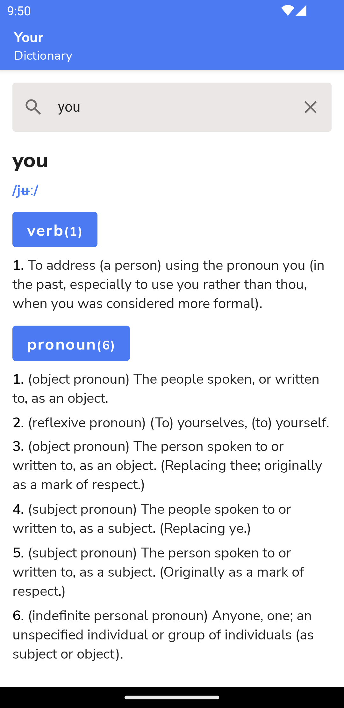
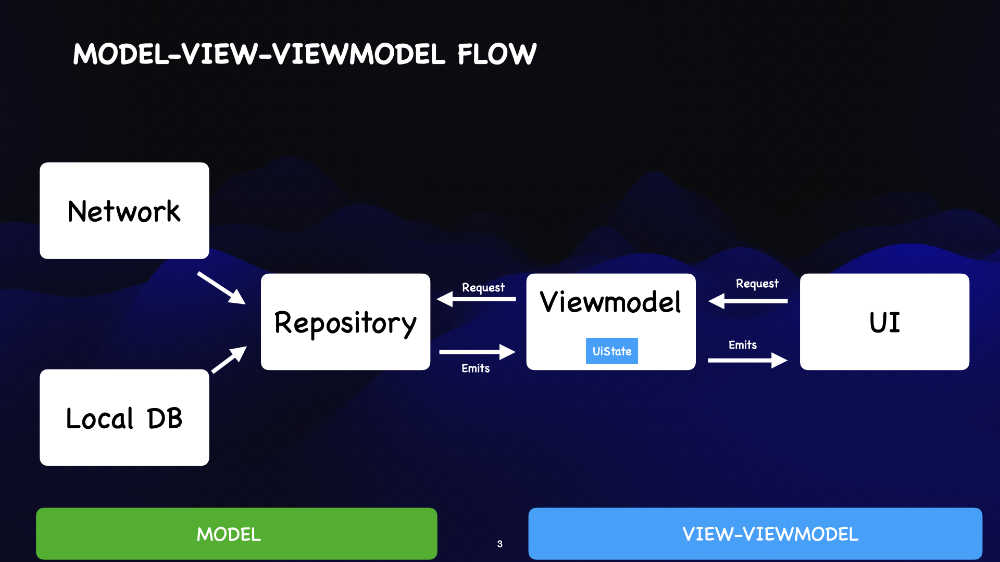

# Your Dictionary
A dictionary application to allow you find definition of words and enhance your vocabulary
Check it out on PlayStore

<a href='https://play.google.com/store/apps/details?id=com.breens.mvvmdictionaryapp'></a>

## Demo

### Home Screen


### Architecture
To decouple the business logic from the UI I opted to use the MVVM design pattern that lead to the codebase seeing benefits like:

* Increased testability of the UI and business logic separately
* Increased maintainability and readability due to the less decoupling of classes
* Allowed as to implement unidirectional data flow that reduced bugs since we had one single source of truth



# License
```xml
Copyright 2023 BreensMbaka

    Licensed under the Apache License, Version 2.0 (the "License");
    you may not use this file except in compliance with the License.
    You may obtain a copy of the License at

    http://www.apache.org/licenses/LICENSE-2.0

    Unless required by applicable law or agreed to in writing, software
    distributed under the License is distributed on an "AS IS" BASIS,
    WITHOUT WARRANTIES OR CONDITIONS OF ANY KIND, either express or implied.
    See the License for the specific language governing permissions and
    limitations under the License.
```  
  
